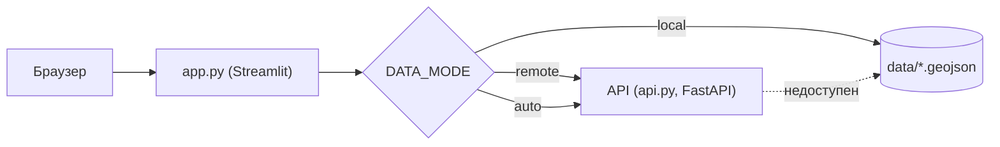

# Fire Monitor

Информационно-аналитический сервис мониторинга природных пожаров: интерактивная карта термоточек и контуров гарей, аналитическая справка по степеням поражения и выгрузка результатов в GeoJSON/JSON.


<!-- TODO: добавить скриншот интерфейса:  -->

## Содержание

- [Обзор](#обзор)
- [Возможности](#возможности)
- [Архитектура](#архитектура)
- [Требования](#требования)
- [Быстрый старт](#быстрый-старт)
- [Конфигурация](#конфигурация)
- [Использование](#использование)
- [Формат данных](#формат-данных)
- [Контракт API](#контракт-api)
- [Демо-данные](#демо-данные)
- [Структура проекта](#структура-проекта)
- [Разработка](#разработка)
- [Устранение неполадок](#устранение-неполадок)
- [Известные ограничения](#известные-ограничения)
- [Лицензия](#лицензия)

## Обзор

Сервис — это веб-интерфейс (Streamlit) поверх двух модулей обработки спутниковых данных:

| Модуль | Назначение | Источник данных |
|--------|-----------|-----------------|
| **AF** (Active Fire) | Термоточки — активное горение | VIIRS, каналы I1–I5 |
| **BS** (Burn Severity) | Контуры гарей и степень поражения | Sentinel-2 + Sentinel-1 |

Интерфейс не содержит бизнес-логики обработки снимков. Он запрашивает готовые результаты у источника данных (локальные GeoJSON-файлы или HTTP API), отображает их и формирует аналитическую справку.

> [!NOTE]
> Проект находится на стадии прототипа. По умолчанию используются **синтетические демо-данные** — см. [Демо-данные](#демо-данные).

## Возможности

- **Пространственно-временной запрос**: ограничивающий прямоугольник (bbox) или произвольная GeoJSON-геометрия, период дат.
- **Карта**: термоточки, контуры гарей по трём классам степени поражения, граница области запроса. Подсказка при наведении показывает атрибуты объекта.
- **Выделение опасных точек**: термоточки, попавшие внутрь контура класса 3 («сильная»), отображаются отдельным цветом и большим размером.
- **Аналитическая справка**: число термоточек и контуров, общая площадь гарей, распределение площади и числа контуров по степеням поражения.
- **Выгрузка**: `thermopoints.geojson`, `burns.geojson`, `summary.json` для выбранного запроса.
- **Три режима источника данных**: локальные файлы, удалённый API, автоматический выбор с откатом на локальные файлы.

## Архитектура



Доступ к данным изолирован за интерфейсом `BaseDataSource`, поэтому интерфейс не зависит от того, откуда пришёл ответ.

| Класс | Источник | Где выполняется фильтрация |
|-------|----------|----------------------------|
| `LocalDataSource` | Файлы в `data/` | В процессе Streamlit (shapely) |
| `RemoteDataSource` | HTTP API по `API_URL` | На стороне API |

## Требования

- Python 3.10 или новее
- Доступ браузера в интернет для подложки карты (тайлы CARTO) и шрифта (Google Fonts). Без него приложение работает, но с ограничениями — см. [Устранение неполадок](#устранение-неполадок)

Зависимости приложения: `streamlit`, `plotly`, `pandas`, `shapely`, `requests` (версии — в `requirements.txt`). Зависимости `api.py` описаны в его отдельном README.

Проверено на Python 3.12 и Streamlit 1.64.

## Быстрый старт

```bash
git clone <URL репозитория>
cd <репозиторий>/service

python -m venv .venv
source .venv/bin/activate          # Windows PowerShell: .venv\Scripts\Activate.ps1

pip install -r requirements.txt
streamlit run app.py
```

Приложение откроется на **http://localhost:8501**.

Запускайте команду именно из каталога `service/`: оттуда Streamlit подхватывает `.streamlit/config.toml` (тема оформления), а приложение — каталог `data/`.

При первом запуске автоматически создаются демо-данные в `service/data/`.

## Конфигурация

### Переменные окружения

| Переменная | По умолчанию | Описание |
|------------|--------------|----------|
| `API_URL` | `http://localhost:8000` | Базовый адрес API для режимов `remote` и `auto` |

```bash
# bash
export API_URL="http://api.example.org:8000"
```

```powershell
# PowerShell
$env:API_URL = "http://api.example.org:8000"
```

### Режим источника данных

Режим задаётся константой `DATA_MODE` в начале `app.py`:

| Значение | Поведение |
|----------|-----------|
| `"local"` (по умолчанию) | Читает файлы из `data/` |
| `"remote"` | Работает только через API по `API_URL`. Если API недоступен, интерфейс показывает ошибку |
| любое другое (например, `"auto"`) | Проверяет `GET /manifest`; при успехе использует API, иначе переключается на локальные файлы |

Текущий режим отображается в подвале страницы.

> [!TIP]
> Чтобы переключать режим без правки кода, замените строку на
> `DATA_MODE = os.getenv("DATA_MODE", "local")`.
> После этого режим можно задавать переменной окружения так же, как `API_URL`.

### Тема оформления

Цвета интерфейса и карты определены в словаре `THEME` в `app.py`. Каждый ключ автоматически становится CSS-переменной (`bg_panel` → `var(--bg-panel)`), а те же значения используются на карте, поэтому палитра меняется в одном месте.

Файл `.streamlit/config.toml` задаёт светлую тему для виджетов, которые нельзя стилизовать через CSS (таблица, радиокнопки, чекбоксы):

```toml
[theme]
base = "light"
primaryColor = "#1f5fa8"
backgroundColor = "#f3f5f8"
secondaryBackgroundColor = "#ffffff"
textColor = "#17212b"
font = "sans serif"
```

При смене палитры в `THEME` обновите и эти значения.

### Порт и адрес

```bash
streamlit run app.py --server.port 8502 --server.address 0.0.0.0
```

## Использование

1. В боковой панели выберите **территорию**: `bbox` (четыре координаты в WGS84, порядок `lon_min, lat_min, lon_max, lat_max`) или `полигон` (GeoJSON `Polygon`, `MultiPolygon`, `Feature` или `FeatureCollection`; у коллекции берётся первый объект).
2. Задайте **период** — даты начала и окончания включительно.
3. Отметьте слои: термоточки (AF), контуры гарей (BS).
4. Нажмите **«Запросить»**. Кнопка неактивна, пока область или период некорректны.
5. Изучите карту и справку, при необходимости скачайте результаты.

Значения по умолчанию (границы дат и bbox) берутся из `manifest.json` источника данных.

### Как применяются фильтры

| Объект | Условие попадания в результат |
|--------|-------------------------------|
| Термоточка | `properties.date` входит в период; точка находится внутри области запроса |
| Контур гари | Интервал `[date_pre, date_post]` пересекается с периодом; геометрия пересекается с областью запроса |

- Если задан полигон, он имеет приоритет над bbox.
- Объекты без даты не отсекаются фильтром по времени.
- Приведённые правила реализованы в `LocalDataSource`. В режиме API их обязан реализовать бэкенд.

### Обозначения на карте

| Элемент | Значение |
|---------|----------|
| Красная точка | Термоточка — активное горение |
| Тёмно-синяя крупная точка | Термоточка внутри контура сильной гари (класс 3) |
| Жёлтый контур | Класс 1 — слабая степень поражения |
| Оранжевый контур | Класс 2 — средняя степень поражения |
| Красный контур | Класс 3 — сильная степень поражения |
| Синяя рамка | Граница области запроса (bbox) |

Контуры с `severity` вне диапазона 1–3 рисуются серым и учитываются только в общей площади.

### Выгрузка

Файлы формируются для последнего выполненного запроса. В локальном режиме — самим приложением, в режиме API — бэкендом.

| Кнопка | Имя файла |
|--------|-----------|
| Термоточки (GeoJSON) | `thermopoints_ГГГГММДД_ГГГГММДД.geojson` |
| Контуры гарей (GeoJSON) | `burns_ГГГГММДД_ГГГГММДД.geojson` |
| Справка (JSON) | `summary_ГГГГММДД_ГГГГММДД.json` |

## Формат данных

Чтобы подключить реальные данные, положите три файла в `data/` в формате ниже. Логику приложения менять не нужно, но обязательно прочитайте [предупреждение о перезаписи данных](#демо-данные) — без поля `demo_version` в манифесте файлы будут заменены демо-набором.

Общие правила: координаты в WGS84, порядок `[долгота, широта]`; даты в формате `ГГГГ-ММ-ДД`; время в UTC.

### `manifest.json`

| Поле | Тип | Назначение |
|------|-----|------------|
| `version` | string | Версия формата |
| `source` | string | Происхождение данных, определяет подпись в интерфейсе (см. ниже) |
| `date_range` | `{min, max}` | Границы дат по умолчанию в фильтре |
| `bbox` | `[lon_min, lat_min, lon_max, lat_max]` | bbox по умолчанию в фильтре |
| `regions` | string[] | Регионы, охваченные данными |
| `counts` | object | Число объектов (`thermopoints`, `burn_polygons`) |
| `demo_version` | int | Версия демо-набора. **Проверяется при каждом старте**: при несовпадении с `DEMO_DATA_VERSION` файлы перезаписываются демо-набором (см. [Демо-данные](#демо-данные)) |
| `generated_at` | string | Время генерации (UTC) |

Значения `source` и подписи в интерфейсе:

| `source` | Подпись |
|----------|---------|
| `fake` | Demo data |
| `af_module` | AF module |
| `bs_module` | BS module |
| `combined` | Real data |
| другое | Неизвестно |

### `thermopoints.geojson`

`FeatureCollection` из объектов с геометрией `Point`.

| Поле `properties` | Тип | Описание | Как используется |
|-------------------|-----|----------|------------------|
| `id` | string | Идентификатор термоточки | Подсказка |
| `chip_id` | string | Идентификатор чипа-источника | Подсказка |
| `date` | string | Дата детекции | **Фильтр по периоду** |
| `datetime` | string | Время пролёта, ISO 8601 UTC | Подсказка |
| `satellite` | string | Спутник | Подсказка |
| `confidence` | number | Уверенность детекции, 0–1 | Подсказка |
| `n_fire_px` | integer | Число пикселей горения | Подсказка |
| `region` | string | Регион | Подсказка |

### `burns.geojson`

`FeatureCollection` из объектов с геометрией `Polygon` или `MultiPolygon`.

| Поле `properties` | Тип | Описание | Как используется |
|-------------------|-----|----------|------------------|
| `id` | string | Идентификатор контура | Подсказка |
| `chip_id` | string | Идентификатор чипа-источника | Подсказка |
| `severity` | integer | Степень поражения: 1, 2 или 3 | **Цвет контура, агрегаты в справке** |
| `severity_label` | string | Подпись: слабая, средняя, сильная | Подсказка |
| `area_ha` | number | Площадь, га | **Суммируется в справке** |
| `date_pre` | string | Дата снимка «до» | **Фильтр по периоду** |
| `date_post` | string | Дата снимка «после» | **Фильтр по периоду** |
| `region` | string | Регион | Подсказка |

Площадь берётся из `area_ha`, по геометрии она не пересчитывается.

## Контракт API

Так `RemoteDataSource` обращается к бэкенду. Таймаут запроса — 60 секунд.

| Метод | Путь | Назначение |
|-------|------|------------|
| `GET` | `/manifest` | Метаданные; в режиме `auto` служит проверкой доступности |
| `POST` | `/query` | Данные и справка для запроса |
| `GET` | `/export/thermopoints.geojson` | Выгрузка термоточек |
| `GET` | `/export/burns.geojson` | Выгрузка контуров |
| `GET` | `/export/summary.json` | Выгрузка справки |

**`POST /query`** — тело запроса:

```json
{
  "bbox": [88.0, 54.0, 96.0, 58.0],
  "polygon": null,
  "date_from": "2023-04-01",
  "date_to": "2023-10-31",
  "include": ["thermopoints", "burns", "summary"]
}
```

Задаётся либо `bbox`, либо `polygon` (GeoJSON-геометрия), второе поле — `null`.

Ответ:

```json
{
  "thermopoints": { "type": "FeatureCollection", "features": [] },
  "burns":        { "type": "FeatureCollection", "features": [] },
  "summary": {
    "n_thermopoints": 0,
    "n_burn_polygons": 0,
    "total_burn_area_ha": 0.0,
    "by_severity": {
      "1": { "area_ha": 0.0, "count": 0, "label": "слабая" },
      "2": { "area_ha": 0.0, "count": 0, "label": "средняя" },
      "3": { "area_ha": 0.0, "count": 0, "label": "сильная" }
    },
    "date_range_actual": { "min": null, "max": null }
  }
}
```

**`GET /export/*`** — параметры строки запроса: `date_from`, `date_to` и одно из: `polygon` (GeoJSON-геометрия, сериализованная в JSON-строку) или `bbox` (`lon_min,lat_min,lon_max,lat_max`).

**Ошибки.** Бэкенд возвращает JSON вида `{"detail": "..."}` и HTTP-статус. Интерфейс реагирует так:

| Статус | Сообщение в интерфейсе |
|--------|------------------------|
| нет соединения / таймаут | Ошибка с адресом API |
| `400` | Невалидный запрос |
| `413` | Слишком большой запрос — сузьте bbox или период |
| `422` | Ошибка валидации |
| `5xx` | Ошибка сервера |

## Демо-данные

Без подключённых реальных данных сервис работает на синтетическом наборе (`source: "fake"`), который создаёт функция `generate_demo_data()`.

| Параметр | Значение |
|----------|----------|
| Термоточек | 358 |
| Контуров гарей | 150 |
| Территория | 88–96° в. д., 54–58° с. ш. (Красноярский край) |
| Период | 2023-04-01 — 2023-10-31 |

Генерация детерминирована (фиксированный `seed`), поэтому набор воспроизводим. Данные нужны для проверки интерфейса и API, пока не подключены предсказания моделей, и **непригодны для принятия решений**.

Демо-данные создаются заново, если:
- отсутствует любой из трёх файлов в `data/`;
- `manifest.json` не читается;
- `demo_version` в манифесте не совпадает с константой `DEMO_DATA_VERSION` в `app.py`.

Чтобы пересоздать набор вручную, удалите каталог `data/` и перезапустите приложение.

> [!WARNING]
> **Реальные данные в `data/` можно потерять.** Проверка выполняется по полю `demo_version` в `manifest.json`, и если его нет, оно считается равным 0, то есть не совпадающим с `DEMO_DATA_VERSION`. В этом случае при запуске приложения все три файла будут заменены демо-набором.
>
> Пока в коде нет проверки `source`, добавьте в манифест реальных данных поле `"demo_version"` со значением, равным текущему `DEMO_DATA_VERSION` (сейчас `2`). Либо ограничьте генерацию в `generate_demo_data()` случаем, когда `source == "fake"`. Не храните единственную копию реальных данных в `data/`.

## Структура проекта

```
service/
├── .streamlit/
│   └── config.toml         # тема оформления Streamlit
├── data/                   # GeoJSON (генерируется или кладётся вручную)
│   ├── manifest.json
│   ├── thermopoints.geojson
│   └── burns.geojson
├── api.py                  # FastAPI-бэкенд (см. отдельный README)
├── app.py                  # это приложение
├── requirements.txt
└── README.md
```

Внутри `app.py`:

| Блок | Содержимое |
|------|------------|
| `THEME`, `SEVERITY_META` | Палитра интерфейса и карты |
| `_CSS` | Стили интерфейса |
| `generate_demo_data` | Генерация синтетического набора |
| `BaseDataSource` и наследники | Доступ к данным (`LocalDataSource`, `RemoteDataSource`) |
| `build_plotly_map` | Построение карты |
| `render_*` | Отрисовка боковой панели, справки, выгрузки |
| `main` | Точка входа |

## Разработка

**Проверка синтаксиса и быстрый прогон интерфейса** (без браузера):

```bash
python -m py_compile app.py
```

```python
from streamlit.testing.v1 import AppTest

at = AppTest.from_file("app.py", default_timeout=60).run()
assert not at.exception

# нажать «Запросить»
next(b for b in at.sidebar.button if b.key == "q_execute").click()
at.run()
assert not at.exception
```

**Добавление нового источника данных.** Создайте класс, наследующий `BaseDataSource`, и реализуйте пять методов: `get_manifest`, `query`, `export_thermopoints`, `export_burns`, `export_summary`. Затем подключите его в `resolve_data_source()`. Остальной код менять не нужно.

**Смена оформления.** Цвета — в `THEME`, правила вёрстки — в `_CSS`. При изменении палитры проверьте и `.streamlit/config.toml`.

## Устранение неполадок

| Симптом | Причина и решение |
|---------|-------------------|
| «API недоступен по адресу …» | Проверьте, что `api.py` запущен, а `API_URL` указан верно. Для работы без API установите `DATA_MODE = "local"` |
| Карта без подложки (серый или белый фон) | Браузеру недоступны тайлы CARTO. В офлайн-среде замените стиль карты на `"white-bg"` в `build_plotly_map` |
| Шрифт отличается от задуманного | Заблокирован `fonts.googleapis.com`. Интерфейс использует системный шрифт и остаётся работоспособным |
| Таблица и чекбоксы выглядят тёмными или красными | Streamlit не нашёл `.streamlit/config.toml`. Запускайте `streamlit run app.py` из каталога `service/` |
| Запрос вернул 0 объектов | Демо-данные покрывают только 88–96° в. д., 54–58° с. ш. и период апрель–октябрь 2023. Расширьте область или период |
| Порт 8501 занят | Запустите с `--server.port 8502` |
| Данные в `data/` неожиданно перезаписаны | Сработала регенерация демо — см. [Демо-данные](#демо-данные) |

## Известные ограничения

- **Локальный режим читает файлы целиком при каждом запросе** и не кэширует результат. Для больших объёмов используйте режим API.
- **Внутренние границы полигонов (дыры) не отображаются** на карте: рисуется только внешний контур. Площадь при этом берётся из `area_ha`.
- **Геометрия пользовательского полигона проверяется только по типу.** Если в локальном режиме она невалидна, фильтр по области не применяется и возвращаются все объекты за выбранный период.
- **Демо-данные синтетические** и не отражают реальной обстановки.

## Лицензия

MIT